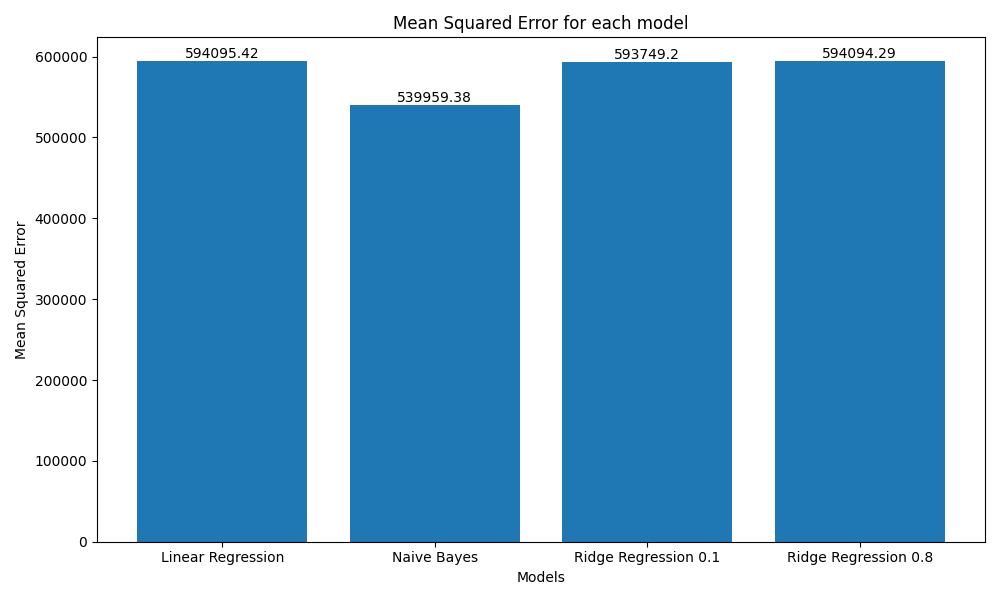
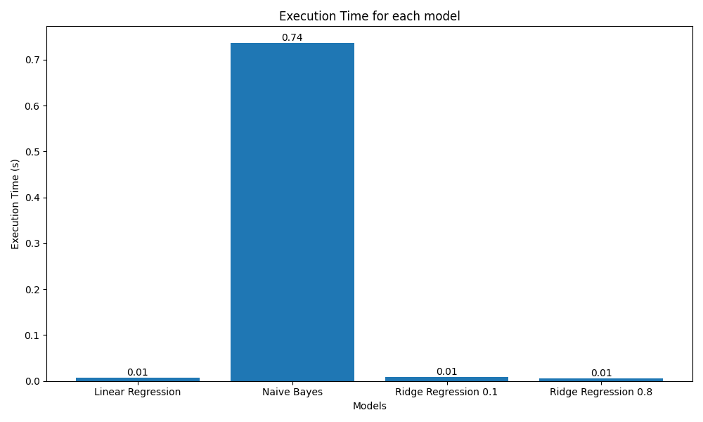
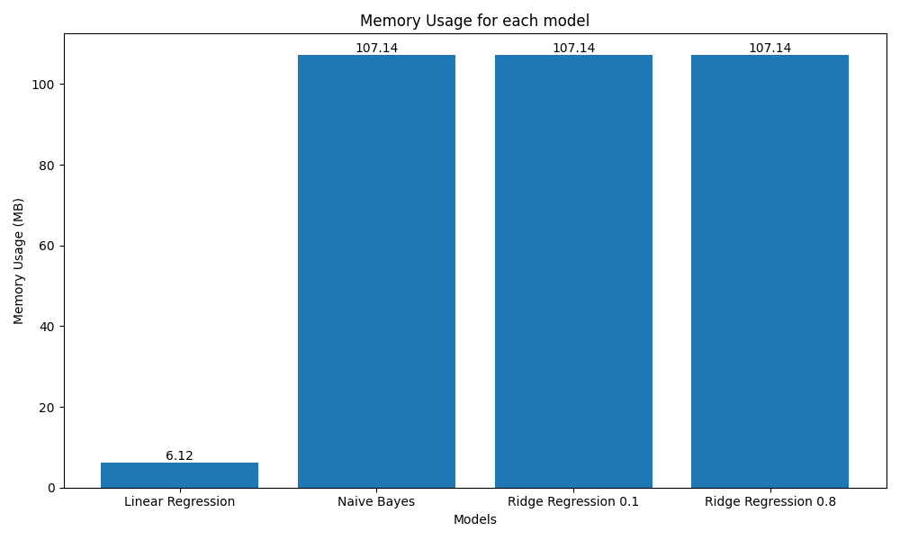
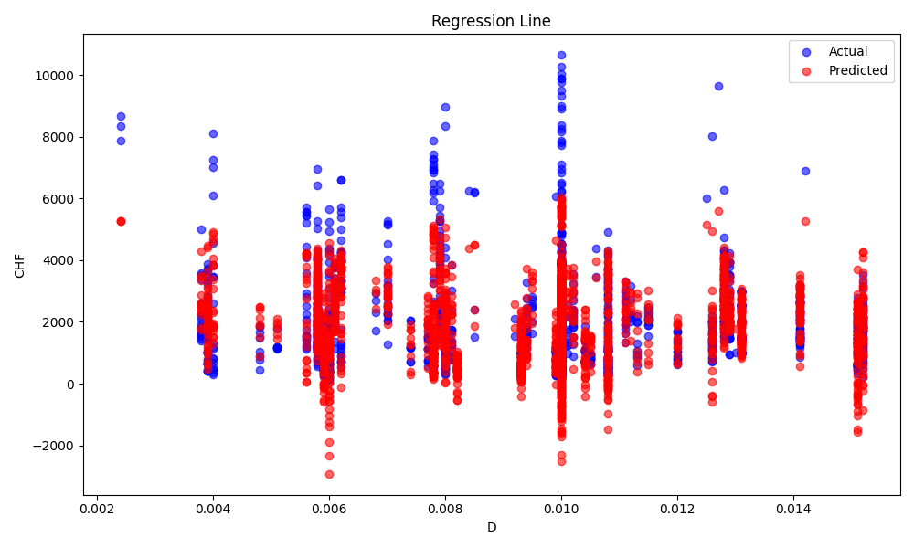
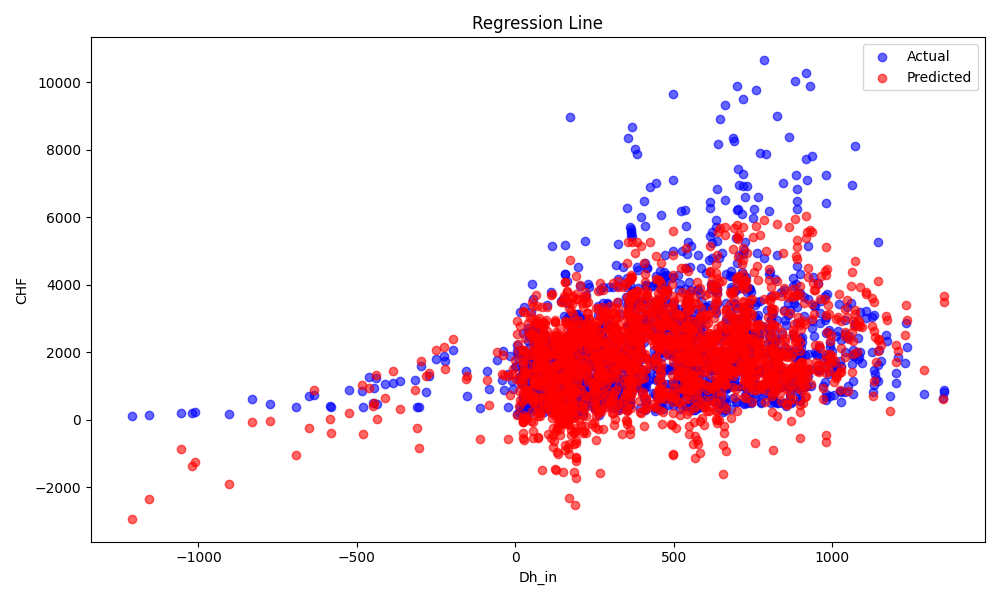
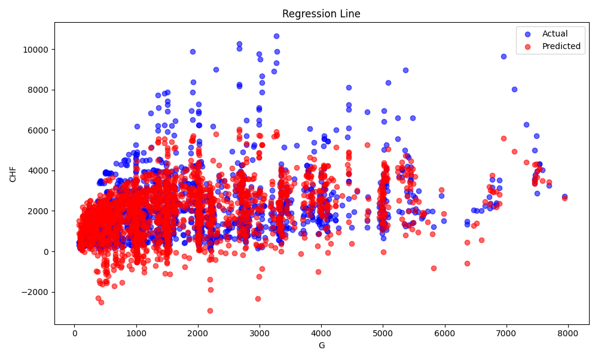
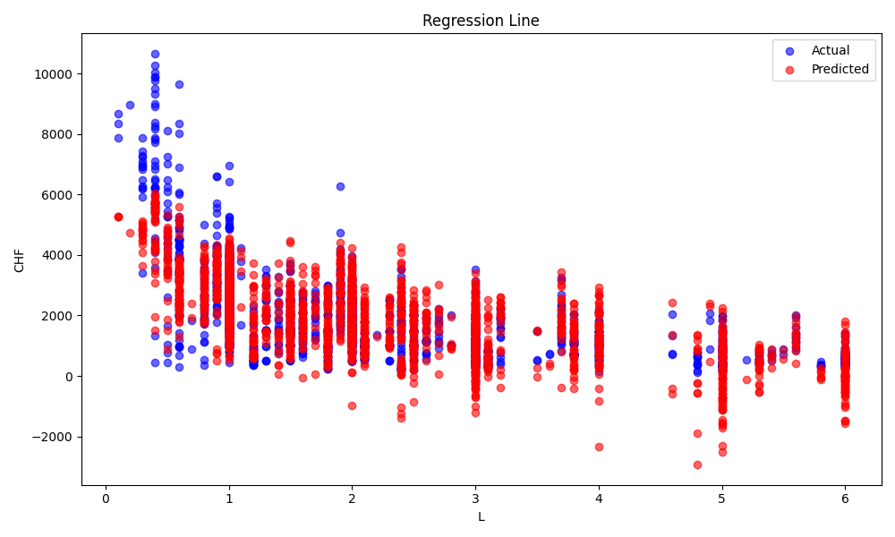
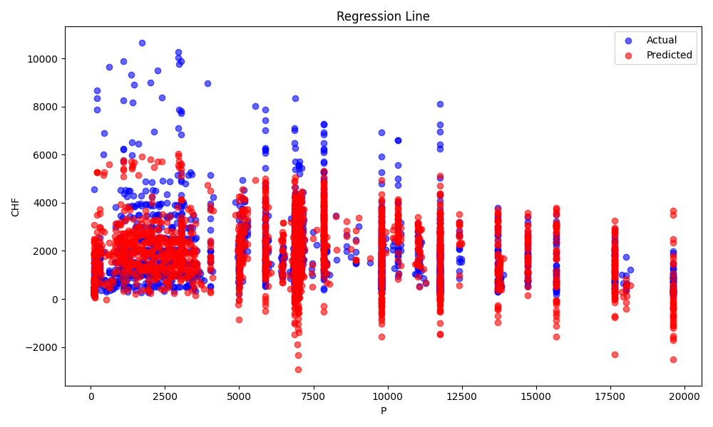
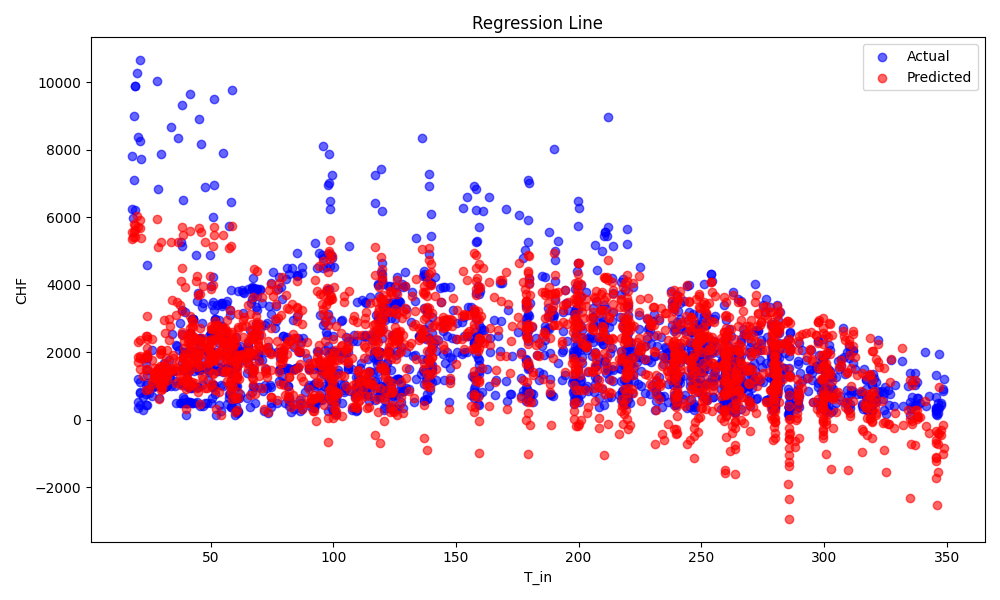
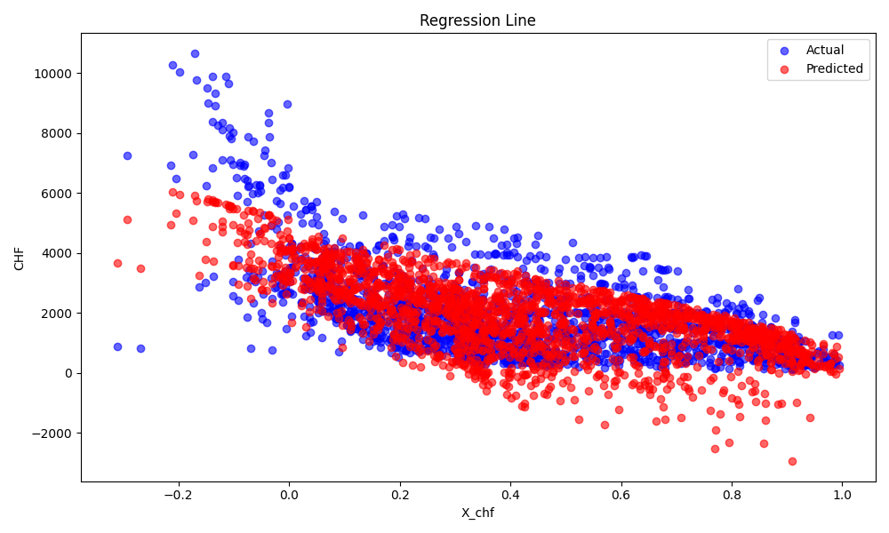

# Modeling Critical Heat Flux using Machine learning algorithms

Erick Gatica Candia, Ph.D. Student in Mechanical Engineering, University of Colorado Boulder

## Abstract

Over the past seven decades, various methods have been developed for predicting Critical Heat Flux (CHF), with early approaches relying heavily on empirical correlations lacking a strong physical basis. These methods have since evolved into more complex physical models and phenomenological equations, which are commonly used in reactor safety analysis. However, these models are highly dependent on the flow regime and controlling mechanisms of CHF, necessitating a combination of approaches to provide accurate predictions. In this project, data from the 2006 Groeneveld CHF Lookup Table, comprising over 25,000 experimental data points, was utilized to develop machine learning models capable of predicting CHF under different conditions. The dataset included parameters such as tube diameter, pressure, mass flux, and inlet temperature. Using the Scikit-learn library, four models were tested: Linear Regression, Naive Bayes, Ridge Regression with alpha 0.1, and Ridge Regression with alpha 0.8. Each model was evaluated based on mean squared error (MSE), execution time, and memory usage. The results showed that Naive Bayes outperformed other models in terms of MSE, but incurred significantly higher processing time. Ridge regression models demonstrated improved generalization through regularization, highlighting the trade-off between accuracy and computational efficiency for CHF prediction.

## Introduction

Over the past 70 years, numerous methods have been developed for predicting critical heat flux (CHF). Early approaches were mostly empirical, relying on basic correlations that lacked a solid physical foundation and had limited applicability. As time progressed, a variety of phenomenological equations and physical models were introduced, many of which were incorporated into reactor safety analysis codes. However, these models depend on the specific mechanisms that govern CHF, which vary with different flow regimes. As a result, multiple models, equations, or correlations must be employed to accurately predict CHF in typical reactor conditions. Given the need for such diversity and the existence of more than 500 CHF correlations for water-cooled tubes alone, a more comprehensive and universal CHF prediction method became necessary [1].

CHF refers to the maximum heat flux (amount of heat per unit area) that can be transferred from a surface to a boiling liquid before the surface temperature dramatically increases. This occurs when a large portion of the heating surface is covered by vapor rather than liquid, which reduces heat transfer.

When CHF is exceeded, it leads to a condition known as boiling crisis or departure from nucleate boiling (DNB). Beyond this point, the surface can overheat, which can be dangerous, especially in reactors or other heat-sensitive systems.

## Method

To analyze if it is possible to build Machine learning based models to predict the CHF in different conditions the data from the Groeneveld was used. 

The data used to derive the 2006 Groeneveld Critical Heat Flux (CHF) Lookup Table comprises over 25,000 experimental CHF data points. These were collected from water-cooled tubes and represent a compilation of 62 datasets gathered over the past 60 years. The datasets vary widely in their conditions, covering different pressures, mass fluxes, diameters, and inlet temperatures. These parameters include tube diameter (D), heated length (L), pressure (P), mass flux (G), critical quality (X_chf), inlet enthalpy (Dh_in), and inlet temperature (T_in), all of which are critical for modeling CHF. This extensive database was used to create a reliable and comprehensive lookup table that can predict CHF across a wide range of conditions​

The data was splitted in a training set and in a test set, this last one being the 20% of the original data set.

The Sklearn library from phyton was used for this project.

The selected model to try were:
- Linear regression model
- Naive Bayes model
- Ridge Linear Regression model with alpha 0.1
- Ridge Linear Regression model with alpha 0.8

The Linear Regression model is a fundamental approach to predictive modeling [2]. It attempts to model the relationship between a dependent variable (in this case, CHF) and one or more independent variables (the input features like D, L, P, G, etc.) by fitting a straight line to the data. The general form of the equation is:

y=β0+β1x1​+β2x2​+…+βn​xn
​

Key Concept: Linear regression finds the coefficients 𝛽 that minimize the sum of the squared differences between the observed values and the predicted values (minimizing the mean squared error). This model assumes that the relationship between inputs and outputs is linear, which is its main limitation when dealing with more complex or non-linear relationships.

Although Naive Bayes is typically used for classification tasks, it can be adapted for regression in some cases (such as Gaussian Naive Bayes). The model assumes that the input features are independent of each other (hence "naive") and follows a specific probability distribution, often Gaussian in regression.

The Gaussian Naive Bayes model calculates the likelihood of each feature given a certain output, using probability distributions to estimate the target variable (CHF) based on these likelihoods [2].

Key Concept: Naive Bayes is powerful when the independence assumption holds true but can be less accurate when the input features are strongly correlated. Unlike linear regression, which is purely deterministic, Naive Bayes incorporates probabilistic reasoning

Ridge Regression [3] is a variant of linear regression that includes a regularization term to address overfitting, especially when there is multicollinearity (i.e., highly correlated features) in the dataset. The Ridge Regression model adds a penalty to the size of the coefficients, which is controlled by the regularization parameter 𝛼.

For Ridge Regression with α = 0.1, the regularization is relatively small, which means the model is closer to standard linear regression. It tries to strike a balance between fitting the data and limiting overfitting by penalizing large coefficient values.

Key Concept: This model is well-suited for situations where the input features are moderately correlated, and the goal is to improve the model’s generalization ability by shrinking the coefficients.

In Ridge Regression with α = 0.8, the regularization is stronger compared to α = 0.1. This means that the model places more emphasis on minimizing the size of the coefficients (shrinkage), which helps in preventing overfitting even more than with α = 0.1.

Key Concept: A larger α results in greater bias but lower variance, making the model more robust to overfitting at the cost of potentially underfitting the data. It is most useful when the data exhibits a high level of noise or when certain features may not be particularly important for prediction.

Each of these models were evaluated on the dataset, and their performance compared in terms of accuracy (mean square error), processing time, and memory usage, giving insights into which approach best balances complexity and predictive power for this particular task.

## Results

The results to present summarized the behavior of the 4 models that were evaluated on this report.

First, in the [Figure 1](#fig1), we can see the comparison of the mean squared error (MSE) for each model.

<!-- Figure 1: Mean Squared Error for each model -->

    
     
    <strong>Figure 1:</strong> Mean Squared Error for each model.

The results indicated that the  model that optimize the MSE value is the Naive Bayes model. While the linear regression models have similar values for MSE.

However, in the [Figure 2](#fig2) can be observed that the Naive Bayes model takes 74 times of execution time than the linear model. Nevertheless, if  time is not a limitation to process this data this will not be a constraint to use this model with this dataset. Otherwise, if the dataset is bigger could be problem for real-time applications. 

<!-- Figure 2: Execution time for each model -->

    
     
    <strong>Figure 2:</strong> Mean Squared Error for each model.

Finally, if we analyze the memory usage for each model we can identify in [Figure 3](fig#3) that the linear regression model with no regularization is the more efficient, while the other ones has a similar performance about benchmarking. 

<!-- Figure 3: Execution time for each model -->

    
     
    <strong>Figure 3:</strong> Memory usage for each model.

In addition to the comparison of the models, the next Figures show the results of the ideal regression for each model:

<!-- Figure 4: Linear regresssion model -->

    
     
    <strong>Figure 4:</strong> Linear regression model.

<!-- Figure 5: Naive Bayes model -->

    
     
    <strong>Figure 5:</strong> Naive Bayes model.

<!-- Figure 6: Ridge Regression model 0.1 -->

    
     
    <strong>Figure 6:</strong> Ridge regression model alpha = 0.1.

<!-- Figure 7: Ridge Regression model 0.8 -->

    
     
    <strong>Figure 7:</strong> Ridge regression model alpha = 0.8.

In [Figure 4](fig#4), [Figure 5](fig#5), [Figure 6](fig#6), and [Figure 7](fig#7) the actual value for CHF and the predicted value are shown. From the plots it is possible to identify that the best behavior from the ideal prediction is obtained using the Naive Bayes model. However, the linear regression models seem able to predict the data with a decent accuracy until the CHF reach out values over 4000. This is to overfitting of the data and to non-linear behavior of the CHF with the features. To explore the non-linearity of CHF due to the features the plots for this variables were obtained using the model with no regularization.

The next Figures show the behavior of actual and predicted CHF value due to the features that were used to train the model

<!-- Figure 8: CHF vs Diameter (m) -->

    
     
    <strong>Figure 8:</strong> CHF vs Diameter (m).

<!-- Figure 9: CHF vs Hydraulic diameter (m) -->

    
     
    <strong>Figure 9:</strong> CHF vs Hydraulic diameter (m).

<!-- Figure 10: CHF vs Mass flow (kg/ms) -->

    
     
    <strong>Figure 10:</strong> CHF vs Mass flow (kg/ms).

<!-- Figure 11: CHF vs Pipe length (kg/ms) -->

    
     
    <strong>Figure 11:</strong> CHF vs Tube length.

<!-- Figure 12: CHF vs Pressure (kPa) -->

    
     
    <strong>Figure 12:</strong> CHF vs Pressure (kPa).

<!-- Figure 13: CHF vs Input temperature (C) -->

    
     
    <strong>Figure 13:</strong> CHF vs Input Temperature (C).

<!-- Figure 14: CHF vs Quality -->

    
     
    <strong>Figure 14:</strong> CHF vs Quality.

From the last plots it was possible to identify that the non-linear behavior of CHF due to the tube length and the input temperature of the fluid probably lead to the miss fitting of the model for high values of CHF. However, for some ranges the estimations seem to be good to predict the target parameter.

## Bibliography 
[1] D.C. Groeneveld, Critical Heat Flux Data Used to Generate the 2006 Groeneveld Lookup Tables (NUREG/KM-0011), (2019). 
https://www.nrc.gov/reading-rm/doc-collections/nuregs/knowledge/km0011/index.html#pub-info

[2] Ng, A. (n.d.). Machine Learning Notes.

[3] Geron, A. (n.d.). Hands-on ML with Scikit-Learn, Keras & TensorFlow: Part 1. GitHub. Retrieved October 17, 2024, from [\[GitHub repository URL\]](https://github.com/Akramz/Hands-on-Machine-Learning-with-Scikit-Learn-Keras-and-TensorFlow?tab=readme-ov-file)